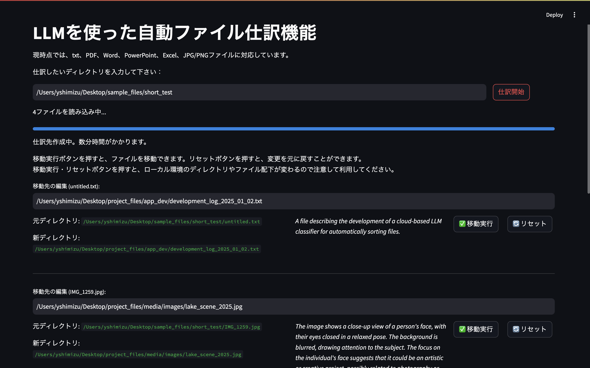

# LLMを使った自動ファイル仕訳機能

このStreamlitアプリケーションは、指定したディレクトリ内のファイルを自動的に分類・改名・移動します。対応ファイル形式はtxt、PDF、Word、PowerPoint、Excel、JPG/PNGです。

主な手法として、大規模言語モデル（LLM）を用いる事で、自動的に各ファイルの読み込み、命名変更、移動先の提示を行います。APIを用いたLLM利用例では、社外秘ファイルを外部に公開してしまう懸念がありましたが、ollamaはローカル環境のみで実行できるため、情報を社内に留めることが可能です。



図1: LLMを使った自動ファイル仕訳機能の出力例

## 機能

- OllamaおよびMoonDream APIを使用したファイル内容の要約
- 生成された要約に基づくファイルの新しいディレクトリ構造の提案
- ファイルの移動およびリセット機能

## セットアップ

1. **リポジトリのクローン**

    ```bash
    git clone https://github.com/yutaro-shimizu/ml_auto_sorting
    cd ml_auto_sorting
    ```

2. **仮想環境の作成とアクティベート**

    ```bash
    python -m venv venv
    source venv/bin/activate  # Windowsでは `venv\Scripts\activate`
    ```

3. **依存関係のインストール**

    ```bash
    pip install -r requirements.txt
    ```

4. **Ollama言語モデルのインストール**

    ```
    https://ollama.com/
    ```    
    をローカル環境にダウンロード。
    ダウンロード後、ターミナルから

    ```
    ollama run llama3
    ollama run moondream
    ```
    を実行して、言語モデルを読み込む。

4. **Streamlitアプリの起動**

    ```bash
    streamlit run main.py
    ```

## 注意事項

- アプリを作動し、ファイルの読み込みを行う間は、ローカル環境の動作が重くなります。
- ファイルの移動操作はローカル環境に影響を与えるため、慎重に操作してください。

